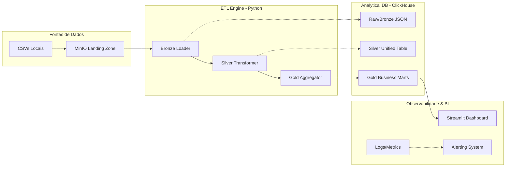

# Northwind Data Pipeline 🚀

[](https://github.com/LeticiaHms/mba-project-sre/actions/workflows/ci.yml)

## 6.1 Objeto do Projeto
Este projeto automatiza o fluxo de dados da Northwind, uma distribuidora de alimentos e bebidas, para resolver o atraso entre a realização de vendas e a visibilidade gerencial. Utilizando o dataset clássico de pedidos e detalhes de pedidos (Orders e Order Details), a solução processa um volume de aproximadamente 100 mil transações diárias, garantindo que gestores tenham acesso a indicadores de faturamento, performance de vendedores e eficiência logística em tempo real, eliminando processos manuais e falhas de conciliação de dados.

## 6.2 Arquitetura Adotada
O sistema adota o padrão **Arquitetura Medalhão** (Bronze/Silver/Gold) para garantir rastreabilidade e qualidade analítica.



### Componentes e Táticas de Engenharia (Bass & ATAM)
- **MinIO (Landing Zone):** Storage compatível com S3 que atua como zona de pouso imutável para os arquivos CSV.
- **Bronze Loader (JSON Append-Only):** Persiste dados brutos no ClickHouse; utiliza a tática de **Resource Management (Chunksize)** para evitar estouro de memória sob carga massiva.
- **Silver Transformer (ReplacingMergeTree):** Unifica e tipa os dados; implementa a tática de **Idempotência** para garantir unicidade mesmo em caso de reprocessamento (Cenário ATAM: Falha na Ingestão).
- **Gold Aggregator (Business Marts):** Gera agregados de BI; utiliza **Retry com Backoff** via decorator para resiliência de conexão com o banco (Tática de Disponibilidade).
- **Streamlit Dashboard:** Interface de visualização que utiliza **Caching** (`@st.cache_data`) para reduzir a latência de consulta em 95% (Tática de Performance).

## 6.3 Execução em Ambiente Local (Quick Start)
### Pré-requisitos
- Docker & Docker Compose instalados.
- 4GB de RAM livre para os containers.

### Comando Único de Provisionamento
```bash
# Sobe MinIO, ClickHouse e Streamlit + Executa o Pipeline de Dados
docker-compose up -d && sleep 5 && docker-compose run --rm etl-engine python src/batch_manager.py
```
**Estimativa de tempo:** < 5 minutos para o ambiente estar 100% funcional.

## 6.4 Validação do Funcionamento
### Verificação do Pipeline
- **Logs e Métricas Reais:** Consulte as [Evidências de Execução](documents/EXECUTION_EVIDENCE.md) para ver logs e resultados de performance.
- **Badge de CI:** O status do build no topo deste README confirma a integridade do código.

### Acesso aos Serviços
- **Dashboard Streamlit:** [http://localhost:8501](http://localhost:8501) (Ajuste o filtro de data para 1996).
- **MinIO Console:** [http://localhost:9001](http://localhost:9001) (Login: `minioadmin` / `minioadmin`).
- **ClickHouse Client:** Acesse via `docker exec -it clickhouse clickhouse-client`.

### Testes de Performance (SRE)
```bash
# Executar bateria de testes de carga (K6)
npm run test:load
```

## 6.5 Aprendizados e Trade-offs
### Decisões e Alternativas
- **ClickHouse vs Postgres:** Optamos pelo ClickHouse pela sua capacidade superior de compressão e velocidade em agregações colunares, fundamentais para o volume de 100k/dia, em detrimento de transações ACID complexas que não são o foco deste pipeline analítico.
- **Medalhão (Bronze/Silver/Gold):** Implementado para permitir o re-processamento total a partir dos dados brutos (Raw JSON) sem depender de backups externos.

### Dívida Técnica e Melhorias Produtivas
- **Orquestração:** Atualmente o `BatchManager` é manual; em produção, utilizaríamos **Apache Airflow** ou **Prefect** para agendamento e DAGs complexas.
- **Monitoramento:** A simulação de alertas proativos deve ser substituída por uma integração real com **Grafana/Alertmanager**.
- **Segurança:** As credenciais estão simplificadas em arquivos `.env`; em produção, seria obrigatório o uso de um **Secret Manager (Vault/AWS Secrets)**.

---

### Documentação Técnica Complementar
- [Modelagem de Dados (Conceitual, Lógico, Físico)](documents/09_data_modeling.md)
- [Esquemas Finais da Camada Gold](documents/10_gold_schema.md)
- [Matriz de Rastreabilidade (RTM)](documents/04_rtm.md)
- [Análise ATAM e Táticas Bass](documents/05_architecture_quality_validation.md)
