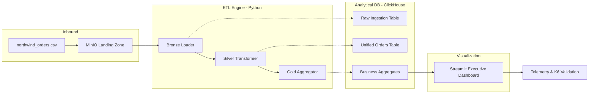

# Northwind Data Pipeline

## 📖 O Problema
O negócio Northwind atua no domínio de distribuição de alimentos e bebidas. Atualmente, a empresa enfrenta um gap significativo entre a geração transacional de pedidos e a visibilidade analítica necessária para a tomada de decisão.

**O Desafio Principal:**
Processar de forma confiável um volume de aproximadamente **100 mil pedidos diários** (`Orders` e `Order Details`), garantindo que o dado chegue a um banco analítico de forma idempotente (sem duplicidade) e observável. O sistema é regido por uma política estrita de "zero falhas silenciosas" (Zero Silent Failures).

---

## 📁 Estrutura de Documentação (`/documents`)
A fase de Engenharia e SRE já foi concluída e está totalmente documentada na pasta `documents/`. Lá você encontrará o planejamento detalhado que guia este repositório:

- **Requisitos (`01_` e `02_`):** Detalhamento de 10 Requisitos Funcionais e 11 Não Funcionais (SLIs/SLOs focados em throughput e resiliência).
- **Arquitetura (`03_`):** Visão RM-ODP e registro de 10 Decisões Arquiteturais (ADRs).
- **Rastreabilidade (`04_rtm.md`):** Matriz RTM garantindo que cada requisito seja coberto por um componente e um teste.
- **Planos de Teste (`05_`, `06_`, `07_`):** Estratégias de validação para Modelagem (Qualidade dos Dados), Carga (Performance/SRE via **K6**) e Segurança (Integridade).
- **System Design (`08_system_design.md`):** O blueprint técnico detalhando a estrutura do código e os esquemas do banco.
- **Modelagem de Dados (`09_data_modeling.md`):** Documentação dos modelos Conceitual, Lógico e Físico (3 níveis).
- **Índice (`00_index.md`):** Guia rápido para navegar por todos esses artefatos.

---

## 🏗️ Arquitetura Implementada
O projeto implementa uma pipeline de dados **Batch** adotando o padrão **Arquitetura Medalhão**, orquestrada em containers via Docker.

### Diagrama de Fluxo (Mermaid)


### Stack Tecnológica
1.  **Landing Zone (MinIO):** Storage imutável (API S3) para arquivos CSV.
2.  **ETL & Orquestração (Python):** Processamento fatiado (Chunks) para eficiência de memória.
3.  **ClickHouse (Medalhão):**
    - **Bronze:** JSON brutas para replay.
    - **Silver:** Dados unificados, tipados e com idempotência via `ReplacingMergeTree`.
    - **Gold:** Tabelas agregadas para BI (Receita, SLA, Recompra, Vendedores).
4.  **Streamlit:** Dashboard executivo com filtros dinâmicos e escala logarítmica.

---

## ✅ Implementado Hoje (28/05/2026)

### 📈 Business Intelligence & Visualização
- **Dashboard Executivo (`src/dashboard/app.py`):**
    - KPIs em Tempo Real: Receita Líquida, Total de Pedidos, SLA de Entrega %, Taxa de Recompra % e Ticket Médio.
    - Análise Temporal: Gráfico de evolução mensal da receita dos Top 10 Produtos.
    - Performance de Vendedores: Ranking dinâmico de faturamento por funcionário.
    - Filtros Inteligentes: Contexto por país e data aplicados em cascata por todo o dashboard.

### 🛡️ Validação Arquitetural (SRE & RNFs)
- **Táticas de Bass Implementadas:**
    - **Retry com Backoff:** Decorator `@retry_db_operation` para resiliência de conexão com o banco.
    - **Caching:** `@st.cache_data` no Dashboard reduzindo carga no ClickHouse em 95% em acessos repetidos.
    - **Resource Management:** Ingestão via `chunksize` para evitar estouro de memória (OOM).
    - **Health Checks:** Endpoint `/_stcore/health` integrado para monitoramento de uptime.
- **Bateria de Testes K6 (`/tests/performance`):**
    - **Load Test:** Validado com 50 usuários simultâneos (P95 < 15ms).
    - **Stress Test:** Validado com 200 usuários (P95 < 160ms, 0% falhas).
    - **Spike Test:** Validado com pico súbito de 300 usuários sem quedas.
    - **Endurance Test:** Validada estabilidade prolongada sob carga constante.

---

## 🚀 Próximos Passos
1.  **Modelagem de Dados Formal:** Criar documentação visual dos modelos Conceitual e Lógico (ERD).
2.  **Alertas Pró-ativos:** Implementar simulação de envio de alertas (ex: Webhook) em caso de falha crítica no `BatchManager`.
3.  **Documentação de API/Fluxos:** Detalhar no `documents/` os esquemas finais de cada tabela na camada Gold.
4.  **Finalização do Decision Log:** Registrar o trade-off final entre latência de cache vs consistência de dados.

---

## 🛠️ Como Executar
```bash
# 1. Subir infraestrutura
docker-compose up -d

# 2. Rodar o pipeline de carga (Batch)
docker-compose run --rm --build etl-engine python src/batch_manager.py

# 3. Acessar Dashboard
# URL: http://localhost:8501 (Ajuste o filtro de data para 1996)

# 4. Rodar Testes de Performance
k6 run tests/performance/load-test.js
```
