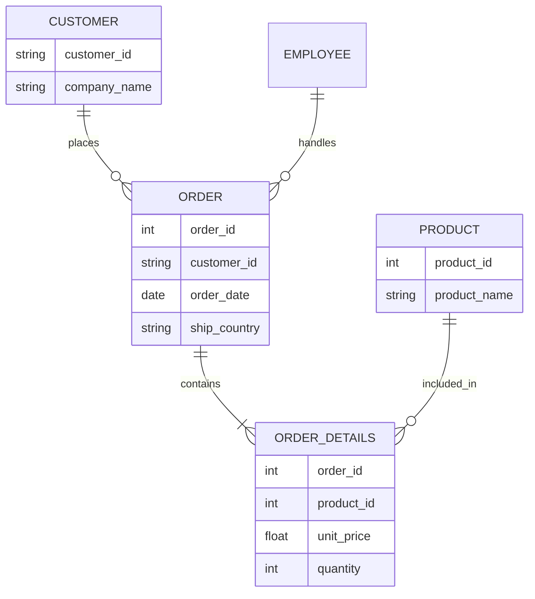
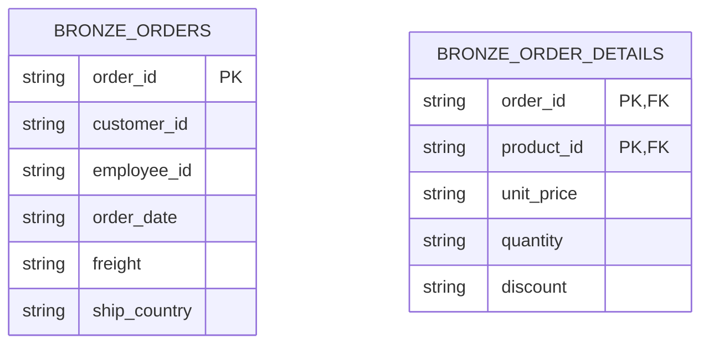
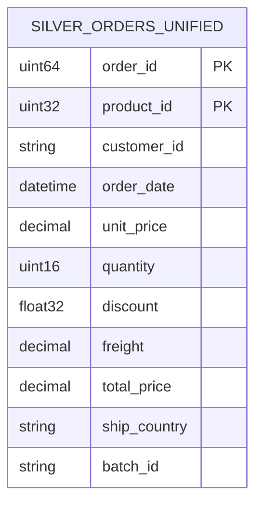

# Modelagem de Dados - Northwind Data Pipeline

Este documento detalha os três níveis de modelagem de dados (Conceitual, Lógico e Físico) adotados para o projeto, descrevendo a evolução da informação desde o CSV original até os agregados de negócio.

## 1. Modelo Conceitual
O modelo conceitual foca nas entidades de negócio e seus relacionamentos de alto nível.

- **Order (Pedido):** Entidade principal representando uma transação comercial.
- **Order Details (Itens do Pedido):** Entidade dependente que detalha os produtos e quantidades de um pedido.
- **Customer (Cliente):** Identificador do comprador.
- **Product (Produto):** Item comercializado.
- **Logística:** Informações de datas (pedido, envio, limite) e destino (país, cidade).

---

## 2. Modelo Lógico
O modelo lógico define a estrutura de tabelas, chaves e normalização. No contexto Medalhão, ele evolui em estágios:

### 2.1 Camada Bronze (Virtual Mirror)
As tabelas Bronze espelham os CSVs originais como JSONs.

### 2.2 Camada Silver (Unified & Normalized)
- **Tabela `silver_orders_unified`:** 
    - **PK:** `(order_id, product_id)`.
    - **Descrição:** Tabela desnormalizada (Flattened) que une Pedido e Itens para facilitar a análise de performance e SLA.
    - **Regras:** Tipagem forte, limpeza de strings e cálculo de `total_price`.

---

## 3. Modelo Físico (ClickHouse)
A implementação física utiliza motores específicos do ClickHouse para otimizar performance e garantir idempotência.

### 3.1 Camada Raw (Append-Only)
Armazenamento imutável de eventos.
- **Tabela:** `northwind_raw.ingestion`
- **Engine:** `MergeTree`
- **Colunas:** `unixtime` (Int64), `data` (String/JSON), `tag` (String).

### 3.2 Camada Silver (Idempotent)
- **Tabela:** `silver_orders_unified`
- **Engine:** `ReplacingMergeTree(silver_loaded_at)`
- **Ordenação (PK):** `(order_id, product_id)`
- **Justificativa:** Garante que reprocessamentos do mesmo pedido não gerem duplicatas, mantendo sempre a versão mais recente carregada.

### 3.3 Camada Gold (Aggregated)
- **Tabelas:** `gold_revenue_monthly`, `gold_logistics_performance`.
- **Engine:** `MergeTree` ou `SummingMergeTree` (para agregados contínuos).
- **Tipagem:** 
    - Financeiro: `Decimal(18, 4)` para evitar erros de arredondamento de float.
    - Temporal: `DateTime` para precisão de segundos e `Date` para dimensões.

---

## 4. Dicionário de Dados (Principais Métricas)

| Campo | Tipo Lógico | Descrição |
| :--- | :--- | :--- |
| `unit_price` | Decimal | Preço unitário do produto no momento da venda. |
| `quantity` | Integer | Quantidade vendida. |
| `discount` | Float | Percentual de desconto aplicado (0 a 1). |
| `total_price` | Decimal | Preço final líquido: `(unit_price * quantity) * (1 - discount)`. |
| `on_time_rate` | Float | Proporção de pedidos onde `shipped_date <= required_date`. |

---

## 5. Linhagem e Auditoria (Audit Trail)
Todos os registros a partir da camada Bronze carregam metadados de controle:
- `source_file`: Identifica o CSV original.
- `batch_id`: Identifica a execução específica do pipeline (UUID).
- `loaded_at`: Timestamp do processamento no ClickHouse.
